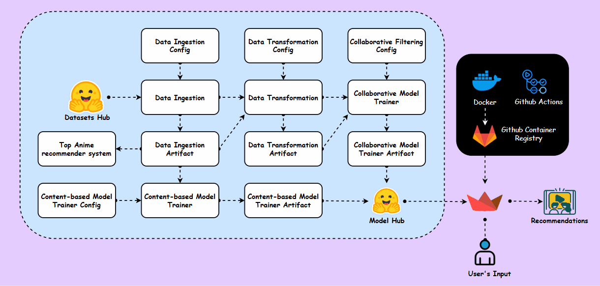
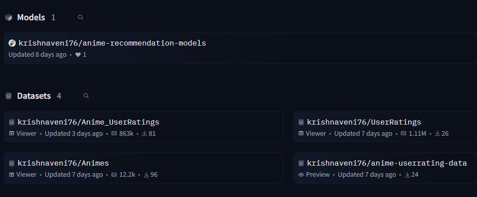
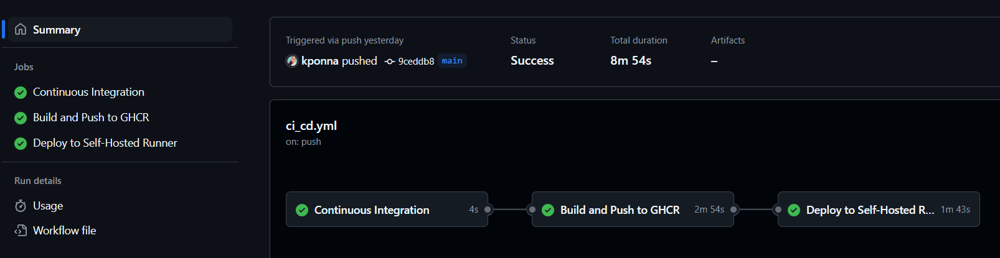
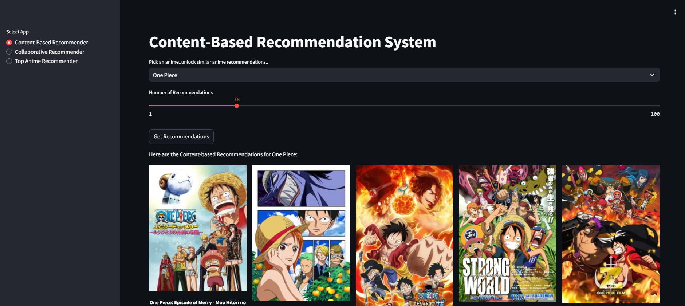

# Anime Recommendation System

 

This **Anime Recommendation System** leverages multiple recommendation techniques, including **Collaborative Filtering**, **Content-Based Filtering**, and **Popularity-Based Filtering**, to provide personalized anime recommendations.

We used the **AnimeList 2023 dataset**, but to optimize computational cost and storage, we included only animes with an average rating above **6.0**. The system is designed for **continuous data ingestion and transformation** and is fully **dockerized** for seamless deployment.

Additionally, **GitHub Actions** automates the **CI/CD** pipeline for deploying the **Streamlit** app, making it easy to update and serve recommendations.

## Live Demo 🤗
[Anime Recommendation System App](https://huggingface.co/spaces/krishnaveni76/Anime-Recommendation-System) 
 
## Tech Stacks 🛠️

- **Python**: Main programming language used for building recommendation algorithms and Streamlit app.
- **Docker**: Containerizes the application to ensure a consistent environment across different platforms.
- **Streamlit**: For building and deploying the web app that serves the recommendations.
- **GitHub Actions**: For Continuous Integration and Continuous Deployment (CI/CD) of the application. 
- **Hugging Face**: The datasets and pretrained models used for getting  recommendations is ingested from Hugging Face, ensuring access to high-quality.

## Pipeline ⛓️

The pipeline follows a structured sequence of steps to build an **Anime Recommendation System**, including data ingestion, transformation, and multiple recommendation models.

### 1. Data Ingestion 📥  
- Initiates the **data ingestion process**, where anime data is loaded from Hugging Face datasets.  
- The ingested data is saved as artifacts in local folder for further processing.

### 2. Data Transformation 🔄  
- Cleans, transforms and processes the raw data into a structured format.  
- Extracts important features required for **Content-Based Filtering** and prepares data for **Collaborative Filtering**.  

### 3. Collaborative Filtering 🤝  
- Implements **three collaborative filtering models** to recommend anime based on user preferences:  
  - **Singular Value Decomposition (SVD)**: Factorizes the user-item interaction matrix to make personalized recommendations.  
  - **Item-Based K-Nearest Neighbors (Item-KNN)**: Recommends anime similar to a given anime based on user ratings.  
  - **User-Based K-Nearest Neighbors (User-KNN)**: Suggests anime that users with similar preferences have liked.  
- The chosen model is trained using **transformed data**, and the final trained model is stored as an artifact.  
- Once trained, it can generate recommendations for users or anime titles.  


### 4. Content-Based Filtering 🎭  
- Uses extracted anime features like genres to train a **Content-Based Recommendation Model**.  
- This model recommends anime similar to those a user has watched or liked.  
  
### 5. Popularity-Based Filtering ⭐  

This recommendation system ranks anime based on various **popularity metrics**, making it ideal for users who want to discover trending or highly-rated shows **without needing personalized preferences**.  

The system applies different filters to sort anime based on:  

- **Most Popular** 🎭: Anime ranked by **popularity score**, highlighting the most widely recognized titles.  
- **Top Ranked** 🏆: Highest-rated anime, based on **official ranking metrics**.  
- **Overall Top Rated** ⭐: Best-rated anime, sorted by **average user ratings**.  
- **Most Favorited** ❤️: Anime with the highest number of **favorites**, indicating strong fan appreciation.  
- **Highest Member Count** 👥: Anime with the largest **viewer base**, showing widespread appeal.  
- **Popular Among Members** 🔥: Anime with a **high number of members and strong ratings**, making them community favorites.  
- **Highest Average Rating** 🎖️: Shows that have the **best average rating** after handling missing values.   

### Artifacts Storage 📂  
All intermediate and final outputs, including processed datasets and trained models, are first saved locally in the Artifacts folder. These artifacts are then uploaded to Hugging Face for efficient storage and easy access. When building the Streamlit app, these datasets and trained models are retrieved directly from Hugging Face, ensuring seamless integration and scalability.
 


- The datasets used in this project are available at:  
    - [Anime and User Ratings](https://www.kaggle.com/datasets/krishnaveniponna/anime-and-ratings-list-dataset-2023)  
      
- You can find the Artifacts of trained models here:  
    - [Pre-trained Models](https://huggingface.co/krishnaveni76/anime-recommendation-models)
   
## CI/CD Pipeline Integration 🔄



To ensure seamless updates and **automated deployment**, this project utilizes **GitHub Actions** for Continuous Integration and Continuous Deployment (CI/CD). The pipeline is structured as follows:

### 1. **Continuous Integration (CI)**
- **Linting & Code Quality Checks**: The repository is checked for linting errors (currently a placeholder for adding an actual linter).  
- **Unit Testing**: Placeholder for running unit tests to ensure the correctness of the application.  

### 2. **Building & Pushing Docker Image**
- Upon a push to the `main` branch, the pipeline builds a **Docker image** of the Streamlit app.  
- The image is tagged with the latest commit SHA and **pushed to GitHub Container Registry (GHCR)** for versioned storage.  

### 3. **Deployment to Self-Hosted Runner**
- The latest Docker image is **pulled from GHCR** onto a **self-hosted runner**.  
- The previous container instance is stopped and removed to avoid conflicts.  
- A new **Streamlit container** is started with the latest version of the application.  

This **automated CI/CD workflow** ensures that every update to the repository is **validated, built, and deployed** efficiently.  

### Pre-requisites
- Docker
- Hugging face (for datasets and trained models)
- Python 3.8+  
- GitHub Actions setup

### Local step 🔧
1. **Clone the repository**
```bash
   git clone https://github.com/kponna/Anime-Recommendation-System_MLops.git
   cd Anime-Recommendation-System_MLops
``` 
2. **Set Up a Virtual Environment**:
```bash
# For macOS and Linux:
python3 -m venv venv 
# For Windows:
python -m venv venv
``` 
3. **Activate the Virtual Environment**:
```bash
# For macOS and Linux:
source venv/bin/activate 
# For Windows:
.\venv\Scripts\activate
``` 
4. **Install Required Dependencies**:
```bash
pip install -r requirements.txt
```

### Running the Pipeline 🔄
To process the data and train the recommendation models, run the following command:

```bash 
python run_pipeline.py
```
This will execute the pipeline, ingest and transform data, and train the models before making recommendations.

### Running with Docker 🐋
To run the application inside a Docker container, follow these steps:

1. Build the Docker Image 
```bash
docker build -t anime-recommendation-system .
```
2. Run the Docker Container 
```bash
docker run -p 8501:8501 anime-recommendation-system
``` 
This will start the Streamlit application, which can be accessed at `http://localhost:8501`.

### Running the Streamlit App 💻

Once the dependencies are installed, you can start the Streamlit app by running:

```bash 
streamlit run app.py
```
This will launch the Anime Recommendation System in your browser. 


 
### Contact 📫
For any questions, suggestions, or collaboration opportunities, feel free to reach out:

📧 Email: ponnakrishnaveni76@gmail.com 

🌐 LinkedIn: [Krishnaveni Ponna](https://www.linkedin.com/in/krishnaveni-ponna-28ab93239)

🐦 Twitter: [@Krishnaveni076](https://x.com/Krishnaveni076)